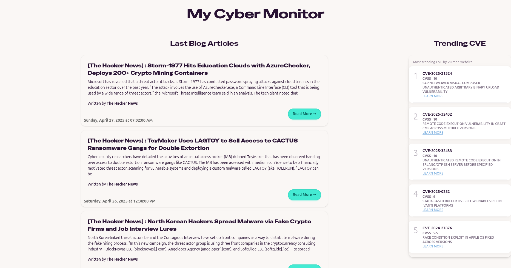

# My Cyber Monitor

Stay informed with the latest trending CVEs and cybersecurity articles, curated for enthusiasts and professionals alike.

---

## 🌐 Sources

We leverage the following trusted sources and blogs to provide you with up-to-date information:

### Trending CVE Scraping

- [Vulmon Trends](https://vulmon.com/trends)

### Blog Articles

- [Synacktiv Blog](https://www.synacktiv.com/)
- [The Hacker News](https://thehackernews.com/)
- [Conquer Your Risk](https://www.conquer-your-risk.com)
- [Quarkslab Blog](https://blog.quarkslab.com)
- [Kaspersky Blog](https://www.kaspersky.com/blog/feed/)
- [Intigriti Blog](https://www.intigriti.com/blog/feed)
- [Infosec Writeups](https://infosecwriteups.com/feed)
- [HackerOne Blog](https://www.hackerone.com/taxonomy/term/291/feed)
- [Root-Me Blog0](https://blog.root-me.org/)

---

## 🎨 Preview



---

## 🐳 How to Install with Docker

You can quickly set up both the frontend and backend using Docker.

### Prerequisites

- [Docker](https://docs.docker.com/get-docker/) installed
- [Docker Compose](https://docs.docker.com/compose/) installed

### Steps

1. Clone the repository:

   ```bash
   git clone https://github.com/your-repo/my-cyber-monitor.git
   cd MyCyberMonitor
   ```

2. Build and start the services:

    ```bash
    docker-compose up
    ```

    or build the docker image :

    ```bash
    docker-compose up --build
    ```

3. Access the application:
    - Frontend : [http://localhost:5175/](http://localhost:5175/)
    - Backend : [http://localhost:8000/docs](http://localhost:8000/docs)

---

## 🎨 Frontend

The frontend provides an intuitive interface to explore the latest cybersecurity trends.  
For installation and setup instructions, refer to the [Frontend Documentation](Front/README.md).

---

## 🛠️ Backend

The backend powers the data aggregation and processing for **My Cyber Monitor**.  
For installation and setup instructions, refer to the [Backend Documentation](backend/README.md).

---

## 📖 How to Contribute

We welcome contributions from the community!  
Feel free to submit issues, suggest features, or create pull requests to improve **My Cyber Monitor**.

---

Thank you for using **My Cyber Monitor**! 💻🔒  
Stay secure and informed. 🚀
